# 🤖⚖️ Legal Mind Agent

> **AI Policy Expert for Regulatory Compliance in Microsoft Teams**

Legal Mind Agent is a multi-agent orchestration solution that ingests global AI regulations, delegates research and risk-scoring to specialist agents, and delivers citation-rich guidance in Microsoft Teams—cutting compliance reviews from days to minutes and keeping them audit-ready. Built on Microsoft's comprehensive AI platform including Bot Framework, Semantic Kernel, Azure AI Foundry, and AI Agents Service, it translates complex regulatory frameworks into actionable recommendations for end users.

> **⚠️ Research Purpose Only**: This solution is designed for research and educational purposes. It is not intended for production use or as a substitute for professional legal advice. Always consult qualified legal professionals for compliance decisions.

## 🏗️ Architecture Overview

```mermaid
graph TB
    User[👤 User in Teams] --> Bot[🤖 Legal Mind Agent]
    Bot --> Router{🧠 Query Intent Router}
    
    Router -->|Regulation Analysis| RegulationAgent[📋 Regulation Analysis Agent]
    Router -->|Risk Assessment| RiskAgent[🔍 Risk Scoring Agent]
    Router -->|Compliance| ComplianceAgent[✅ Compliance Expert]
    Router -->|Policy Translation| PolicyAgent[📖 Policy Translation Agent]
    Router -->|Comparative Analysis| ComparativeAgent[⚖️ Comparative Regulatory Analyst]
    
    RegulationAgent --> Coordinator[🎯 Response Coordinator]
    RiskAgent --> Coordinator
    ComplianceAgent --> Coordinator
    PolicyAgent --> Coordinator
    ComparativeAgent --> Coordinator
    
    Coordinator --> Response[📤 Citation-Rich Compliance Guidance]
    Response --> User
```



## 🎯 Core Features

### 🔧 Specialized AI Policy Agents

| Agent | Expertise | Sample Queries |
|-------|-----------|----------------|
| **Regulation Analysis** | AI regulation ingestion, framework analysis | *"Analyze EU AI Act requirements for our chatbot"* |
| **Risk Scoring** | Risk assessment, compliance scoring | *"Score compliance risk for facial recognition deployment"* |
| **Compliance Expert** | Regulatory compliance, audit preparation | *"GDPR compliance checklist for AI data processing"* |
| **Policy Translation** | Complex regulation interpretation, actionable guidance | *"Translate NIST AI framework into implementation steps"* |
| **Comparative Regulatory** | Cross-jurisdictional regulatory analysis | *"Compare US vs EU AI governance requirements"* |

### 💼 Use Cases

- **AI Companies**: Regulatory compliance assessment for AI products and services
- **Technology Teams**: Risk scoring and compliance guidance for AI implementations
- **Compliance Officers**: Global AI regulation analysis and audit preparation
- **Product Managers**: Actionable regulatory guidance for AI feature development
- **Legal Teams**: Citation-rich compliance reports and regulatory research

## 🚀 Quick Start

### Prerequisites

- **Microsoft Teams** account with bot deployment permissions
- **Azure Account** with App Service and Bot Service access  
- **Python 3.11+** for local development

### 1. Clone and Setup

```bash
git clone https://github.com/cyber-gray/Legal-Mind-AI.git
cd Legal-Mind-AI

# Install dependencies
pip install -r requirements.txt
```

### 2. Environment Configuration

Set these environment variables:

```bash
export MicrosoftAppId="your-bot-app-id"
export MicrosoftAppPassword="your-bot-app-password"
export PORT=80  # Optional, defaults to 80
```

### 3. Run Locally

```bash
python main.py
```

The bot will start on `http://localhost:80` with health check at `/health`.

## 🔧 Technical Stack

| Component | Technology | Purpose |
|-----------|------------|---------|
| **Bot Framework** | Microsoft Bot Framework SDK 4.15 | Teams integration & conversational interface |
| **AI Orchestration** | Azure AI Foundry + AI Agents Service | Multi-agent coordination and workflow management |
| **Semantic Processing** | Microsoft Semantic Kernel | AI plugin orchestration and prompt management |
| **Web Server** | aiohttp 3.9 | Async HTTP server for bot endpoints |
| **Cloud Platform** | Azure Container Apps + Azure AI Services | Scalable deployment and AI model hosting |
| **Monitoring** | Azure Application Insights + Custom health checks | Service monitoring, telemetry, and diagnostics |

## 🛡️ Security & Compliance

- **Microsoft Bot Framework Authentication** - Secure Teams integration with OAuth 2.0
- **Azure AI Foundry Security** - Enterprise-grade AI model access controls
- **Environment Variable Configuration** - Secure credential management via Azure Key Vault
- **Semantic Kernel Security** - Built-in prompt injection protection and content filtering
- **Error Handling & Logging** - Comprehensive error tracking with Azure Application Insights
- **Health Monitoring** - Multi-layer service health checks and telemetry
- **Production Hardening** - Docker security best practices and Azure security baseline

---

**Legal Mind Agent** - *Transforming regulatory complexity into actionable compliance guidance* 🤖⚖️✨
